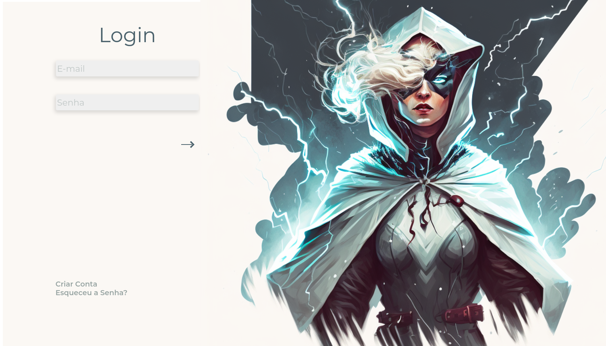
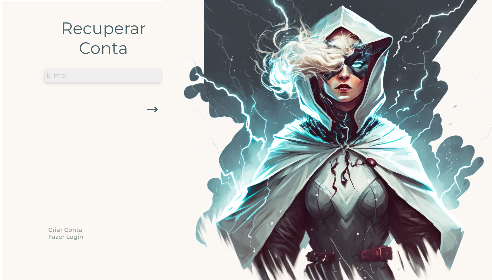
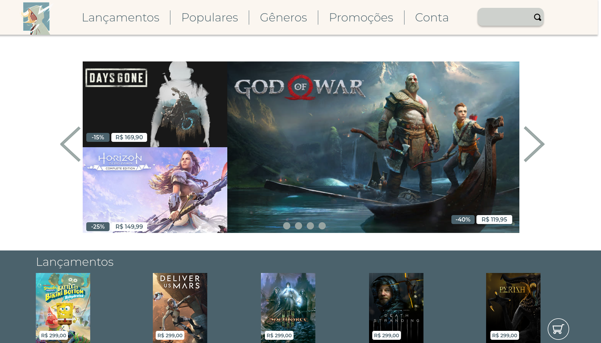

# EmakersJs

## Descrição

Implementa cinco telas do site fictício "Game Dame", sendo essas: a página de criar conta, de fazer login, recuperar conta, a página "home" e uma página mostrando os detalhes do jogo "God of War".

## Tecnologias Utilizadas

- **ReactJS**
- **HTML:5**
- **CSS:3**

## Como Executar Localmente

### Pré-requisitos para construir a aplicação
- NodeJS instalado
- Vite instalado

### Passos para Executar Localmente

1. Clone o repositório:

    ```bash
    git clone https://github.com/seuusuario/emakersjs
    cd emakersjs
    ```

2. Instale as dependências:

    ```bash
    npm install
    ```

3. Inicie a aplicação:

    ```bash
    npm run dev
    ```

4. Abra o navegador e acesse:

    ```
    http://localhost:5173
    ```

## Imagens das Páginas

### Página de Criar Conta


### Página de Fazer Login



### Página de Recuperar Conta



### Página Home



### Página de Detalhes do Jogo "God of War"


